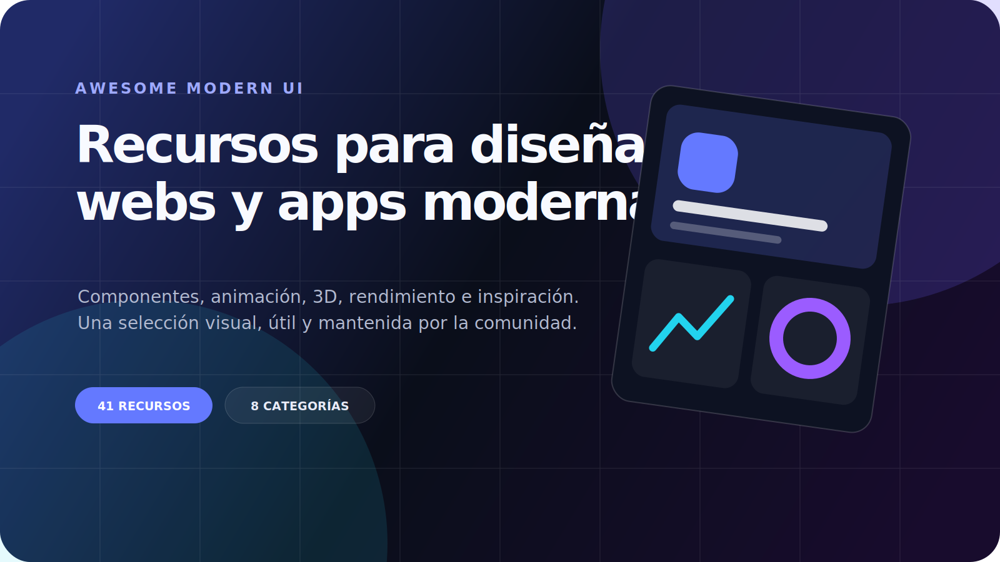

<p align="center">
  <a href="https://awesome-modern-ui.vercel.app">
    
  </a>
</p>

<h1 align="center">Awesome Modern UI</h1>

<p align="center">
  Directorio visual de herramientas para diseñar páginas web y aplicaciones modernas.
</p>

<p align="center">
  <a href="https://awesome-modern-ui.vercel.app"><strong>Explorar la web</strong></a>
  ·
  <a href="https://awesome-modern-ui.vercel.app/recursos">Ver recursos</a>
  ·
  <a href="https://awesome-modern-ui.vercel.app/plantillas">Ver diseños</a>
  ·
  <a href="https://awesome-modern-ui.vercel.app/componentes">Ver componentes</a>
</p>

<p align="center">
  
  
  
</p>

## Qué encontrarás

- Herramientas para UI, animación, 3D, accesibilidad, rendimiento y SEO.
- Referencias visuales para landings, dashboards, portfolios y productos digitales.
- Una ficha por recurso con descripción, recomendación, licencia, precio y sitio oficial.
- Imágenes locales para que el catálogo también sea visual dentro de GitHub.
- Una selección corta: solo recursos útiles para crear mejores webs y apps.

## Explorar por categoría

- [Stack moderno](#stack) · 5
- [Componentes y UI](#componentes) · 6
- [Animación](#animacion) · 10
- [3D](#3d) · 3
- [Rendimiento](#rendimiento) · 5
- [Accesibilidad](#accesibilidad) · 3
- [SEO y analítica](#seo-analitica) · 3
- [Patrones e inspiración](#patrones) · 6

## Recursos destacados

| | |
| --- | --- |
| <a href="https://awesome-modern-ui.vercel.app/recursos/nextjs"></a> | <a href="https://awesome-modern-ui.vercel.app/recursos/tailwind-css"></a> |
| <a href="https://awesome-modern-ui.vercel.app/recursos/shadcn-ui"></a> | <a href="https://awesome-modern-ui.vercel.app/recursos/radix-ui"></a> |
| <a href="https://awesome-modern-ui.vercel.app/recursos/gsap"></a> | <a href="https://awesome-modern-ui.vercel.app/recursos/motion"></a> |
| <a href="https://awesome-modern-ui.vercel.app/recursos/threejs"></a> | <a href="https://awesome-modern-ui.vercel.app/recursos/web-quality-skills"></a> |

<a id="stack"></a>

## Stack moderno

| Vista | Recurso |
| --- | --- |
| <a href="https://awesome-modern-ui.vercel.app/recursos/nextjs"></a> | **[Next.js](https://nextjs.org)**<br>Framework React para aplicaciones web de producción.<br><sub>MIT · gratis</sub> |
| <a href="https://awesome-modern-ui.vercel.app/recursos/react"></a> | **[React](https://react.dev)**<br>Biblioteca para construir interfaces por componentes.<br><sub>MIT · gratis</sub> |
| <a href="https://awesome-modern-ui.vercel.app/recursos/typescript"></a> | **[TypeScript](https://www.typescriptlang.org)**<br>JavaScript con tipos para proyectos mantenibles.<br><sub>Apache-2.0 · gratis</sub> |
| <a href="https://awesome-modern-ui.vercel.app/recursos/nodejs"></a> | **[Node.js](https://nodejs.org)**<br>Runtime JavaScript para tooling y servidor.<br><sub>MIT · gratis</sub> |
| <a href="https://awesome-modern-ui.vercel.app/recursos/tailwind-css"></a> | **[Tailwind CSS](https://tailwindcss.com)**<br>Framework CSS utility-first para sistemas visuales.<br><sub>MIT · gratis</sub> |

<a id="componentes"></a>

## Componentes y UI

| Vista | Recurso |
| --- | --- |
| <a href="https://awesome-modern-ui.vercel.app/recursos/shadcn-ui"></a> | **[shadcn/ui](https://ui.shadcn.com)**<br>Componentes accesibles que pasan a ser parte de tu código.<br><sub>MIT · gratis</sub> |
| <a href="https://awesome-modern-ui.vercel.app/recursos/radix-ui"></a> | **[Radix UI](https://www.radix-ui.com)**<br>Primitivos accesibles y sin estilos para React.<br><sub>MIT · gratis</sub> |
| <a href="https://awesome-modern-ui.vercel.app/recursos/base-ui"></a> | **[Base UI](https://base-ui.com)**<br>Primitivos React sin estilos y con accesibilidad.<br><sub>MIT · gratis</sub> |
| <a href="https://awesome-modern-ui.vercel.app/recursos/react-aria"></a> | **[React Aria](https://react-spectrum.adobe.com/react-aria)**<br>Hooks y componentes accesibles de Adobe.<br><sub>Apache-2.0 · gratis</sub> |
| <a href="https://awesome-modern-ui.vercel.app/recursos/magic-ui"></a> | **[Magic UI](https://magicui.design)**<br>Bloques animados para productos y landings.<br><sub>MIT · freemium</sub> |
| <a href="https://awesome-modern-ui.vercel.app/recursos/react-bits"></a> | **[React Bits](https://reactbits.dev)**<br>Componentes React creativos y animados.<br><sub>MIT · gratis</sub> |

<a id="animacion"></a>

## Animación

| Vista | Recurso |
| --- | --- |
| <a href="https://awesome-modern-ui.vercel.app/recursos/gsap"></a> | **[GSAP](https://gsap.com)**<br>Motor profesional de animación web.<br><sub>GSAP · gratis</sub> |
| <a href="https://awesome-modern-ui.vercel.app/recursos/scrolltrigger"></a> | **[ScrollTrigger](https://gsap.com/docs/v3/Plugins/ScrollTrigger)**<br>Plugin GSAP para animación vinculada al scroll.<br><sub>GSAP · gratis</sub> |
| <a href="https://awesome-modern-ui.vercel.app/recursos/splittext"></a> | **[SplitText](https://gsap.com/docs/v3/Plugins/SplitText)**<br>Plugin GSAP para animar texto por líneas y caracteres.<br><sub>GSAP · gratis</sub> |
| <a href="https://awesome-modern-ui.vercel.app/recursos/morphsvg"></a> | **[MorphSVG](https://gsap.com/docs/v3/Plugins/MorphSVGPlugin)**<br>Transformaciones fluidas entre formas SVG.<br><sub>GSAP · gratis</sub> |
| <a href="https://awesome-modern-ui.vercel.app/recursos/motion"></a> | **[Motion](https://motion.dev)**<br>Animación productiva para React y JavaScript.<br><sub>MIT · gratis</sub> |
| <a href="https://awesome-modern-ui.vercel.app/recursos/lenis"></a> | **[Lenis](https://lenis.darkroom.engineering)**<br>Scroll suave accesible y ligero.<br><sub>MIT · gratis</sub> |
| <a href="https://awesome-modern-ui.vercel.app/recursos/rive"></a> | **[Rive](https://rive.app)**<br>Diseño y runtime para animación interactiva.<br><sub>Propietaria · freemium</sub> |
| <a href="https://awesome-modern-ui.vercel.app/recursos/auto-animate"></a> | **[AutoAnimate](https://auto-animate.formkit.com)**<br>Animaciones automáticas para cambios de layout.<br><sub>MIT · gratis</sub> |
| <a href="https://awesome-modern-ui.vercel.app/recursos/view-transitions-api"></a> | **[CSS View Transitions API](https://developer.mozilla.org/docs/Web/API/View_Transition_API)**<br>Transiciones nativas entre estados y documentos.<br><sub>Estándar web · gratis</sub> |
| <a href="https://awesome-modern-ui.vercel.app/recursos/scroll-driven-animations"></a> | **[CSS Scroll-Driven Animations](https://developer.mozilla.org/docs/Web/CSS/CSS_scroll-driven_animations)**<br>Animaciones CSS ligadas al progreso del scroll.<br><sub>Estándar web · gratis</sub> |

<a id="3d"></a>

## 3D

| Vista | Recurso |
| --- | --- |
| <a href="https://awesome-modern-ui.vercel.app/recursos/threejs"></a> | **[Three.js](https://threejs.org)**<br>Motor 3D de referencia para la web.<br><sub>MIT · gratis</sub> |
| <a href="https://awesome-modern-ui.vercel.app/recursos/react-three-fiber"></a> | **[React Three Fiber](https://r3f.docs.pmnd.rs)**<br>Renderer React para Three.js.<br><sub>MIT · gratis</sub> |
| <a href="https://awesome-modern-ui.vercel.app/recursos/spline"></a> | **[Spline](https://spline.design)**<br>Editor colaborativo de diseño 3D para web.<br><sub>Propietaria · freemium</sub> |

<a id="rendimiento"></a>

## Rendimiento

| Vista | Recurso |
| --- | --- |
| <a href="https://awesome-modern-ui.vercel.app/recursos/next-image"></a> | **[next/image](https://nextjs.org/docs/app/api-reference/components/image)**<br>Optimización integrada de imágenes en Next.js.<br><sub>MIT · gratis</sub> |
| <a href="https://awesome-modern-ui.vercel.app/recursos/next-font"></a> | **[next/font](https://nextjs.org/docs/app/getting-started/fonts)**<br>Carga y autoalojamiento optimizado de fuentes.<br><sub>MIT · gratis</sub> |
| <a href="https://awesome-modern-ui.vercel.app/recursos/vercel"></a> | **[Vercel](https://vercel.com)**<br>Plataforma de despliegue optimizada para frontend.<br><sub>Propietaria · freemium</sub> |
| <a href="https://awesome-modern-ui.vercel.app/recursos/core-web-vitals"></a> | **[Core Web Vitals](https://web.dev/vitals)**<br>Métricas de experiencia real: LCP, INP y CLS.<br><sub>Estándar web · gratis</sub> |
| <a href="https://awesome-modern-ui.vercel.app/recursos/web-quality-skills"></a> | **[Web Quality Skills](https://github.com/addyosmani/web-quality-skills)**<br>Reglas reutilizables para Lighthouse, Core Web Vitals, WCAG 2.2 y SEO.<br><sub>MIT · gratis</sub> |

<a id="accesibilidad"></a>

## Accesibilidad

| Vista | Recurso |
| --- | --- |
| <a href="https://awesome-modern-ui.vercel.app/recursos/prefers-reduced-motion"></a> | **[prefers-reduced-motion](https://developer.mozilla.org/docs/Web/CSS/@media/prefers-reduced-motion)**<br>Preferencia del sistema para reducir movimiento.<br><sub>Estándar web · gratis</sub> |
| <a href="https://awesome-modern-ui.vercel.app/recursos/lucide"></a> | **[Lucide](https://lucide.dev)**<br>Iconos SVG consistentes y personalizables.<br><sub>ISC · gratis</sub> |
| <a href="https://awesome-modern-ui.vercel.app/recursos/fontsource"></a> | **[Fontsource](https://fontsource.org)**<br>Fuentes open source empaquetadas para autoalojamiento.<br><sub>MIT · gratis</sub> |

<a id="seo-analitica"></a>

## SEO y analítica

| Vista | Recurso |
| --- | --- |
| <a href="https://awesome-modern-ui.vercel.app/recursos/vercel-analytics"></a> | **[Vercel Web Analytics](https://vercel.com/analytics)**<br>Analítica web conectada al despliegue.<br><sub>Propietaria · freemium</sub> |
| <a href="https://awesome-modern-ui.vercel.app/recursos/ga4"></a> | **[Google Analytics 4](https://developers.google.com/analytics/devguides/collection/ga4)**<br>Analítica avanzada y medición de campañas.<br><sub>Propietaria · gratis</sub> |
| <a href="https://awesome-modern-ui.vercel.app/recursos/json-ld"></a> | **[JSON-LD](https://json-ld.org)**<br>Datos estructurados enlazados en JSON.<br><sub>Estándar web · gratis</sub> |

<a id="patrones"></a>

## Patrones e inspiración

| Vista | Recurso |
| --- | --- |
| <a href="https://awesome-modern-ui.vercel.app/recursos/backdrop-filter"></a> | **[backdrop-filter](https://developer.mozilla.org/docs/Web/CSS/backdrop-filter)**<br>Filtros detrás de superficies translúcidas.<br><sub>Estándar web · gratis</sub> |
| <a href="https://awesome-modern-ui.vercel.app/recursos/liquid-glass"></a> | **[Liquid Glass](https://developer.apple.com/design/human-interface-guidelines/materials)**<br>Dirección visual de superficies fluidas y estratificadas.<br><sub>Patrón de diseño · gratis</sub> |
| <a href="https://awesome-modern-ui.vercel.app/recursos/glassmorphism"></a> | **[Glassmorphism](https://www.smashingmagazine.com/2021/07/glassmorphism-css)**<br>Paneles translúcidos con profundidad.<br><sub>Patrón de diseño · gratis</sub> |
| <a href="https://awesome-modern-ui.vercel.app/recursos/bento-grid"></a> | **[Bento Grid](https://bentogrids.com)**<br>Composición modular con jerarquía variable.<br><sub>Patrón de diseño · gratis</sub> |
| <a href="https://awesome-modern-ui.vercel.app/recursos/mobbin"></a> | **[Mobbin](https://mobbin.com)**<br>Biblioteca de flujos reales de productos digitales.<br><sub>Propietaria · freemium</sub> |
| <a href="https://awesome-modern-ui.vercel.app/recursos/godly"></a> | **[Godly](https://godly.website)**<br>Curaduría de sitios con dirección visual actual.<br><sub>Propietaria · gratis</sub> |

## Diseños y componentes

La web incluye ejemplos completos para ver cómo se combinan estas herramientas:

- [Landing cinematográfica](https://awesome-modern-ui.vercel.app/plantillas/landing)
- [Dashboard moderno](https://awesome-modern-ui.vercel.app/plantillas/dashboard)
- [Portfolio editorial](https://awesome-modern-ui.vercel.app/plantillas/portfolio)
- [Experiencia inmersiva](https://awesome-modern-ui.vercel.app/plantillas/cinematic)
- [Bloques de interfaz](https://awesome-modern-ui.vercel.app/componentes)

## Ejecutar la web

```bash
corepack pnpm install
corepack pnpm dev
```

Después abre `http://localhost:3000`.

## Actualizar el catálogo

```bash
corepack pnpm resources:images
corepack pnpm readme:generate
corepack pnpm check
```

El catálogo, las portadas y este README se generan desde
`apps/web/lib/catalog.ts`.

## Contribuir

Abre un issue o pull request en [https://github.com/jesusoldekamp-hue/awesome-modern-ui](https://github.com/jesusoldekamp-hue/awesome-modern-ui) con:

- enlace oficial;
- licencia y precio;
- motivo concreto para recomendarlo;
- evidencia de mantenimiento activo;
- categoría adecuada y alternativas que reemplazaría.

## Créditos

Proyecto original de [Jesus Sagaon](https://github.com/jesusoldekamp-hue).
Inspirado por la recopilación pública
[AndersonMoncayo/awesome-modern-ui](https://github.com/AndersonMoncayo/awesome-modern-ui).

## Licencia

Código propio bajo [MIT](./LICENSE). Los recursos enlazados conservan las
licencias, marcas y derechos de sus respectivos autores.
