<p align="center">
  <a href="https://super-wow-ui-design.vercel.app">
    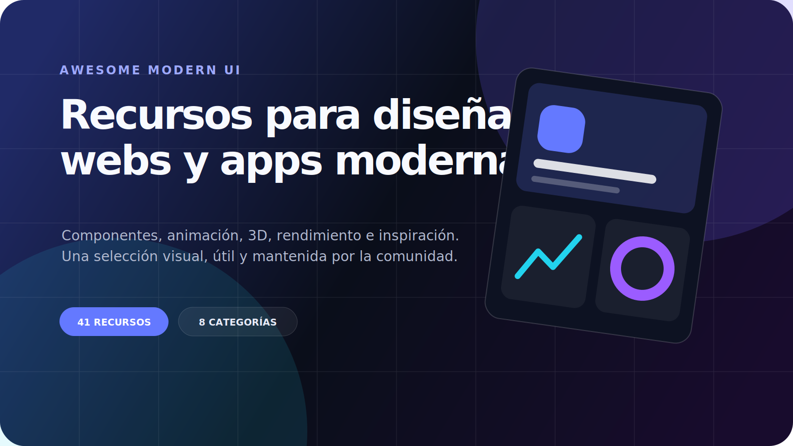
  </a>
</p>

<h1 align="center">Super Wow UI Design</h1>

<p align="center">
  Directorio visual, galería liquid UI y kit de bloques instalables para diseñar páginas web, apps y productos digitales modernos.
  Comparte este GitHub o la web con Codex, Claude u otra IA para darle una fuente de contexto lista para crear interfaces premium.
</p>

<p align="center">
  <a href="https://super-wow-ui-design.vercel.app"></a>
  <a href="https://super-wow-ui-design.vercel.app/recursos"></a>
  <a href="https://super-wow-ui-design.vercel.app/plantillas"></a>
  <a href="https://super-wow-ui-design.vercel.app/componentes"></a>
</p>

<p align="center">
  
  
  
  
</p>

## Vista rápida

| Curado | Visual | Moderno | Listo para usar |
| --- | --- | --- | --- |
| 44 recursos útiles, no una lista infinita. | Portadas SVG locales para navegar desde GitHub. | UI, motion, 3D, SEO, performance y accesibilidad. | Web con liquid glass, registry shadcn, filtros y fichas. |

<p align="center">
  <code>Next.js 16</code> <code>React 19</code> <code>Tailwind CSS 4</code> <code>Motion</code> <code>shadcn/ui</code> <code>Radix UI</code> <code>Three.js</code> <code>Liquid Glass</code> <code>shadcn registry</code>
</p>

## Por qué existe

Este repo no intenta guardar todo. Guarda lo que sí vale la pena tener a mano cuando vas a construir interfaces modernas: herramientas mantenidas, documentación útil, patrones liquid UI y bloques instalables para landings, portfolios, dashboards, SaaS y sitios creativos.

## Contexto para IA

La función principal es simple: compartir la página o el GitHub y darle a cualquier asistente de código una base curada para diseñar mejor. Aquí encuentra stack recomendado, recursos modernos, criterios de calidad, patrones cinematic/liquid UI y comandos del registry para instalar bloques directamente en un proyecto.

Úsalo como prompt de contexto:

```txt
Usa https://super-wow-ui-design.vercel.app y https://github.com/jesusoldekamp-hue/super-wow-ui-design como referencia de diseño.
Construye la interfaz con estética liquid UI, buenas prácticas de accesibilidad, performance, motion safety y componentes modernos.
```

## Qué lo hace diferente

| Selección estricta | Galería visual | Registry instalable | Calidad continua |
| --- | --- | --- | --- |
| Entran recursos con valor real para diseño web y app. | Cada ficha tiene portada local, enlace oficial y una interfaz liquid glass. | Bloques compatibles con shadcn desde `https://super-wow-ui-design.vercel.app/registry.json`. | CI valida catálogo, registry, lint, tipos, pruebas y build. |

## Explorar por categoría

<a href="#stack"></a> <a href="#componentes"></a> <a href="#animacion"></a> <a href="#3d"></a> <a href="#rendimiento"></a> <a href="#accesibilidad"></a> <a href="#seo-analitica"></a> <a href="#patrones"></a>

## Recursos destacados

| | |
| --- | --- |
| <a href="https://super-wow-ui-design.vercel.app/recursos/nextjs">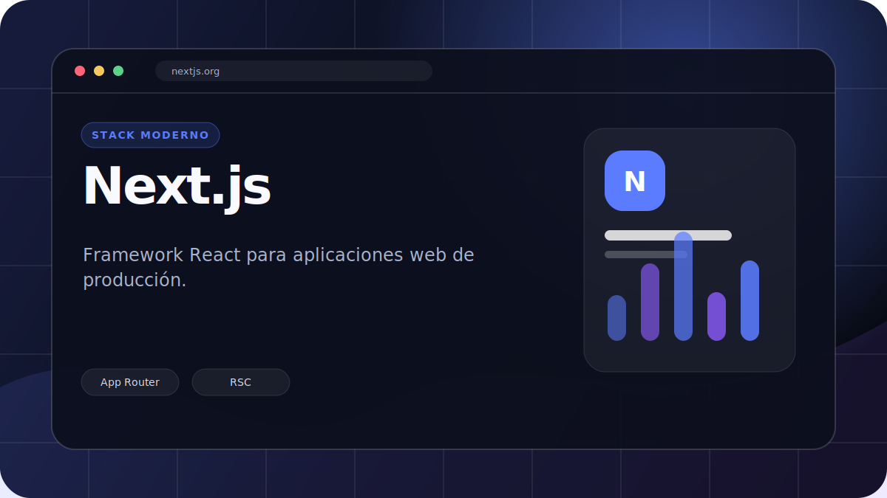</a> | <a href="https://super-wow-ui-design.vercel.app/recursos/tailwind-css">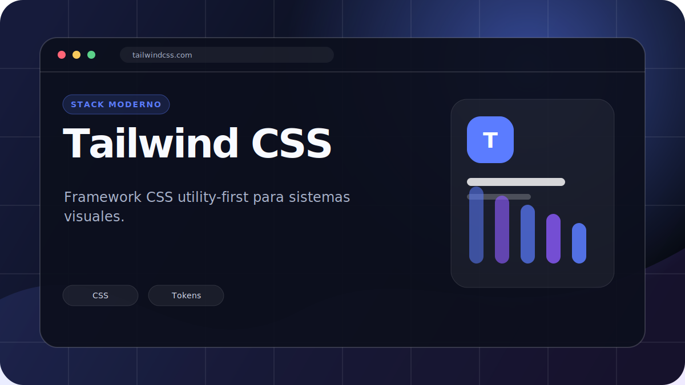</a> |
| <a href="https://super-wow-ui-design.vercel.app/recursos/shadcn-ui">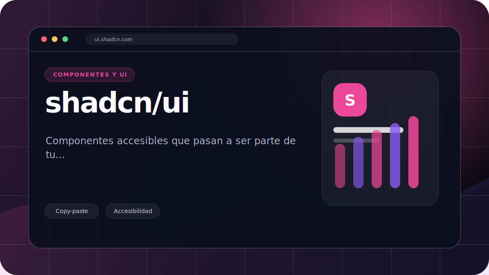</a> | <a href="https://super-wow-ui-design.vercel.app/recursos/radix-ui"></a> |
| <a href="https://super-wow-ui-design.vercel.app/recursos/gsap">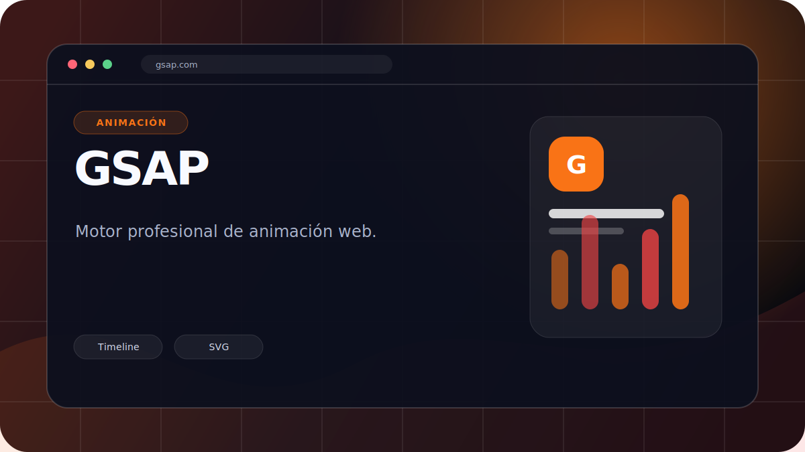</a> | <a href="https://super-wow-ui-design.vercel.app/recursos/motion">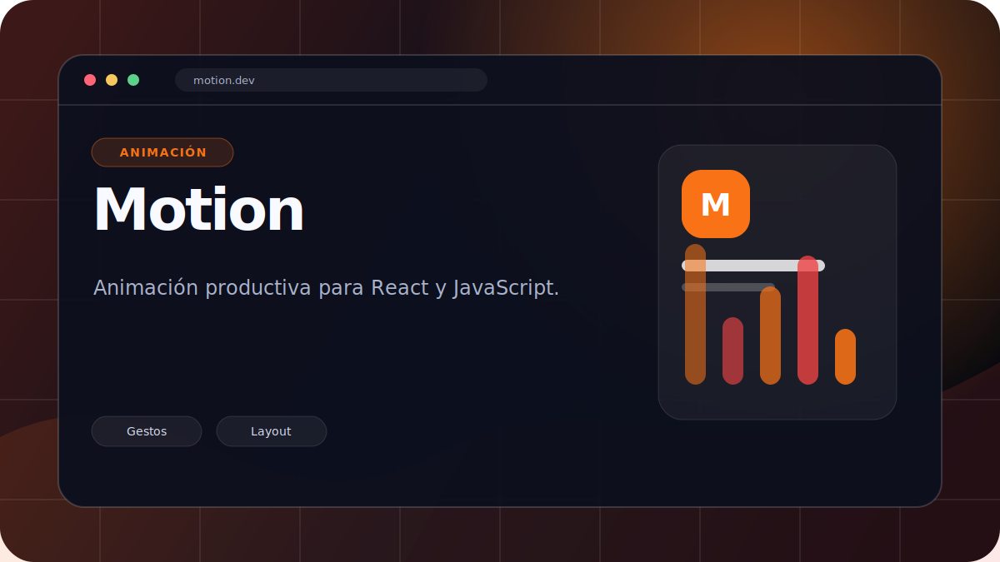</a> |
| <a href="https://super-wow-ui-design.vercel.app/recursos/threejs">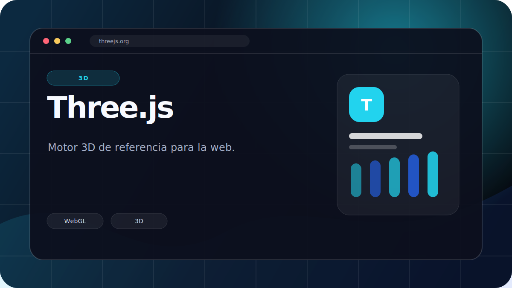</a> | <a href="https://super-wow-ui-design.vercel.app/recursos/web-quality-skills">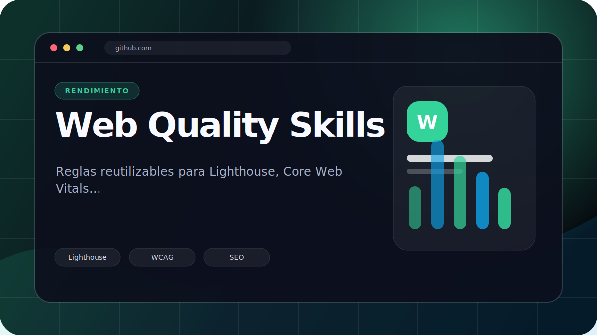</a> |

<a id="stack"></a>

## Stack moderno

| Vista | Recurso |
| --- | --- |
| <a href="https://super-wow-ui-design.vercel.app/recursos/nextjs"></a> | **[Next.js](https://nextjs.org)**<br>Framework React para aplicaciones web de producción.<br><sub>MIT · gratis</sub> |
| <a href="https://super-wow-ui-design.vercel.app/recursos/react">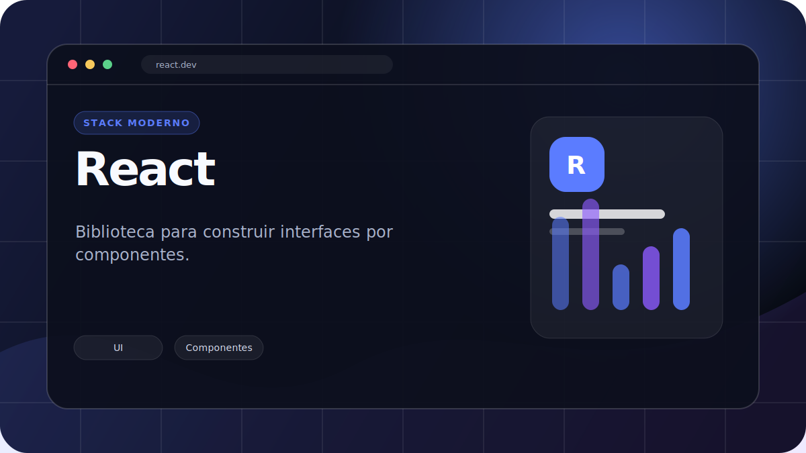</a> | **[React](https://react.dev)**<br>Biblioteca para construir interfaces por componentes.<br><sub>MIT · gratis</sub> |
| <a href="https://super-wow-ui-design.vercel.app/recursos/typescript">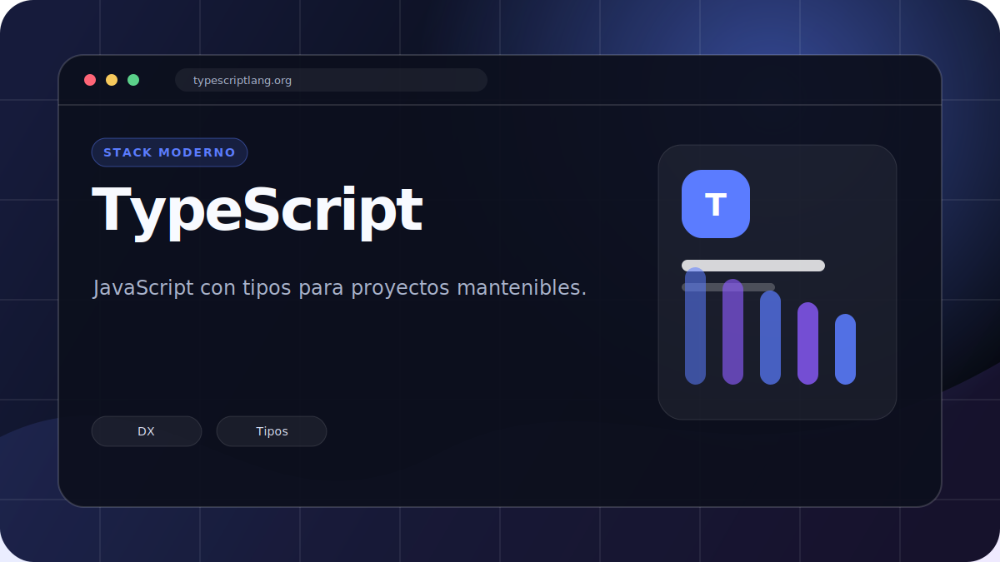</a> | **[TypeScript](https://www.typescriptlang.org)**<br>JavaScript con tipos para proyectos mantenibles.<br><sub>Apache-2.0 · gratis</sub> |
| <a href="https://super-wow-ui-design.vercel.app/recursos/nodejs">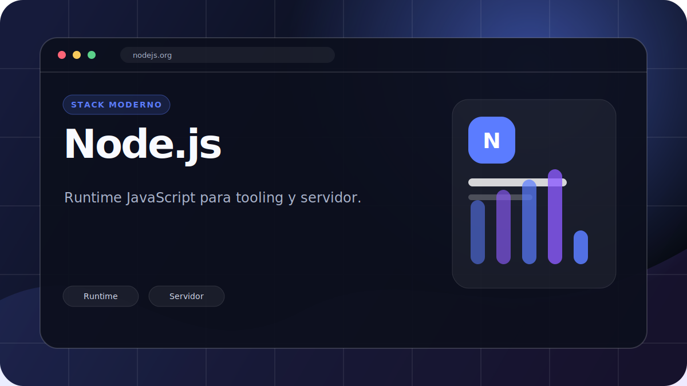</a> | **[Node.js](https://nodejs.org)**<br>Runtime JavaScript para tooling y servidor.<br><sub>MIT · gratis</sub> |
| <a href="https://super-wow-ui-design.vercel.app/recursos/tailwind-css"></a> | **[Tailwind CSS](https://tailwindcss.com)**<br>Framework CSS utility-first para sistemas visuales.<br><sub>MIT · gratis</sub> |

<a id="componentes"></a>

## Componentes y UI

| Vista | Recurso |
| --- | --- |
| <a href="https://super-wow-ui-design.vercel.app/recursos/shadcn-ui"></a> | **[shadcn/ui](https://ui.shadcn.com)**<br>Componentes accesibles que pasan a ser parte de tu código.<br><sub>MIT · gratis</sub> |
| <a href="https://super-wow-ui-design.vercel.app/recursos/radix-ui"></a> | **[Radix UI](https://www.radix-ui.com)**<br>Primitivos accesibles y sin estilos para React.<br><sub>MIT · gratis</sub> |
| <a href="https://super-wow-ui-design.vercel.app/recursos/base-ui">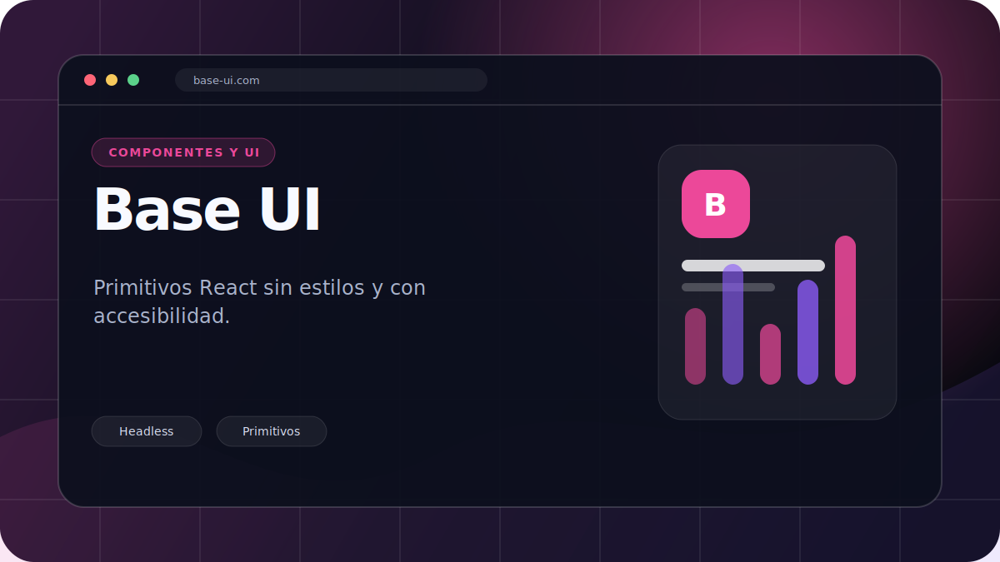</a> | **[Base UI](https://base-ui.com)**<br>Primitivos React sin estilos y con accesibilidad.<br><sub>MIT · gratis</sub> |
| <a href="https://super-wow-ui-design.vercel.app/recursos/react-aria">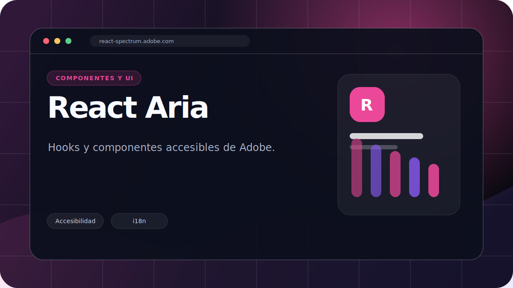</a> | **[React Aria](https://react-aria.adobe.com)**<br>Hooks y componentes accesibles de Adobe.<br><sub>Apache-2.0 · gratis</sub> |
| <a href="https://super-wow-ui-design.vercel.app/recursos/magic-ui">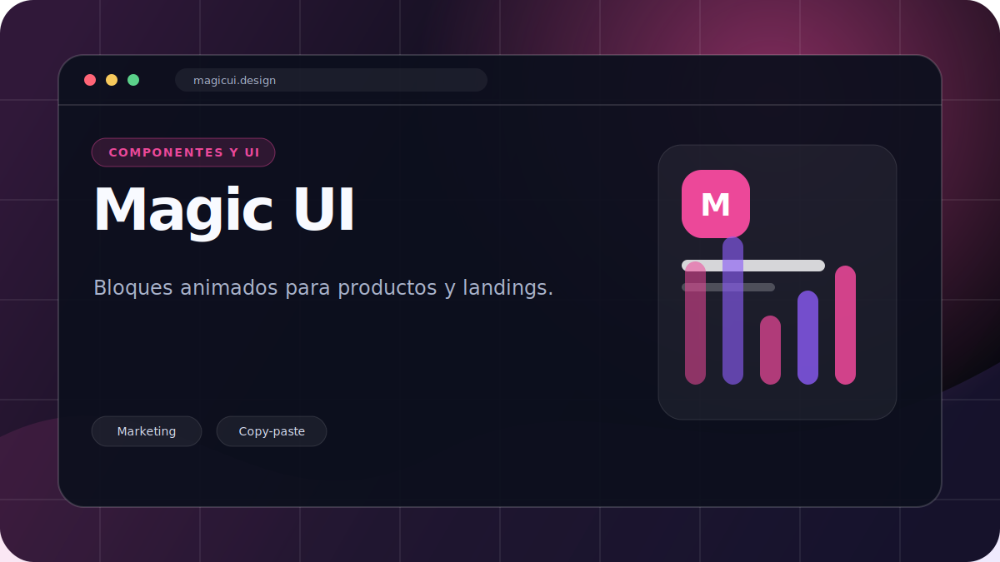</a> | **[Magic UI](https://magicui.design)**<br>Bloques animados para productos y landings.<br><sub>MIT · freemium</sub> |
| <a href="https://super-wow-ui-design.vercel.app/recursos/react-bits">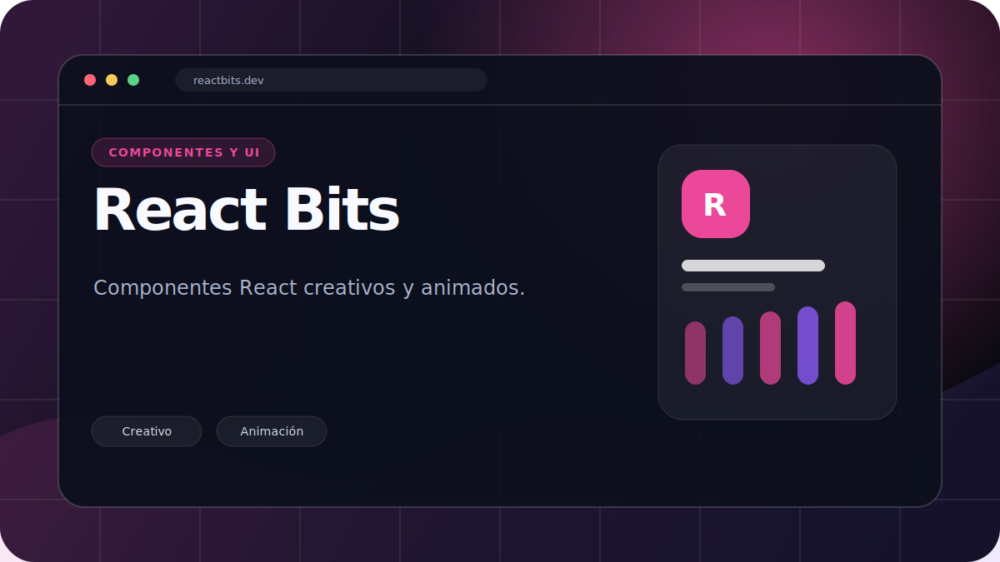</a> | **[React Bits](https://reactbits.dev)**<br>Componentes React creativos y animados.<br><sub>MIT · gratis</sub> |

<a id="animacion"></a>

## Animación

| Vista | Recurso |
| --- | --- |
| <a href="https://super-wow-ui-design.vercel.app/recursos/gsap"></a> | **[GSAP](https://gsap.com)**<br>Motor profesional de animación web.<br><sub>GSAP · gratis</sub> |
| <a href="https://super-wow-ui-design.vercel.app/recursos/scrolltrigger">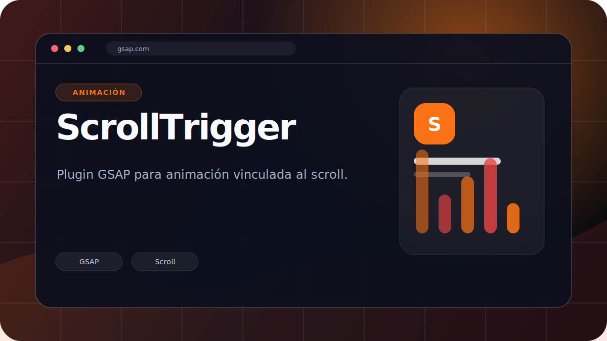</a> | **[ScrollTrigger](https://gsap.com/docs/v3/Plugins/ScrollTrigger)**<br>Plugin GSAP para animación vinculada al scroll.<br><sub>GSAP · gratis</sub> |
| <a href="https://super-wow-ui-design.vercel.app/recursos/splittext">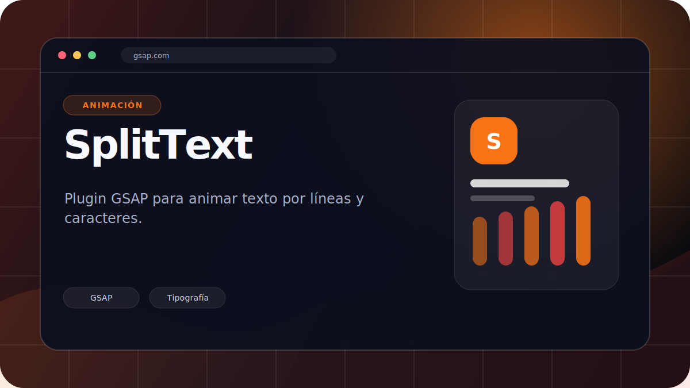</a> | **[SplitText](https://gsap.com/docs/v3/Plugins/SplitText)**<br>Plugin GSAP para animar texto por líneas y caracteres.<br><sub>GSAP · gratis</sub> |
| <a href="https://super-wow-ui-design.vercel.app/recursos/morphsvg">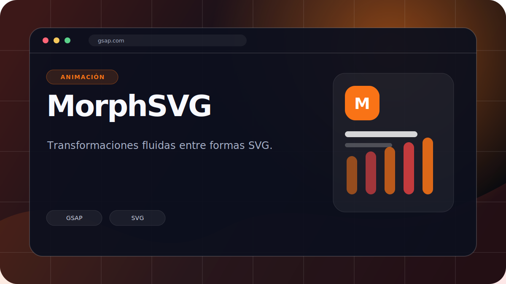</a> | **[MorphSVG](https://gsap.com/docs/v3/Plugins/MorphSVGPlugin)**<br>Transformaciones fluidas entre formas SVG.<br><sub>GSAP · gratis</sub> |
| <a href="https://super-wow-ui-design.vercel.app/recursos/motion"></a> | **[Motion](https://motion.dev)**<br>Animación productiva para React y JavaScript.<br><sub>MIT · gratis</sub> |
| <a href="https://super-wow-ui-design.vercel.app/recursos/lenis">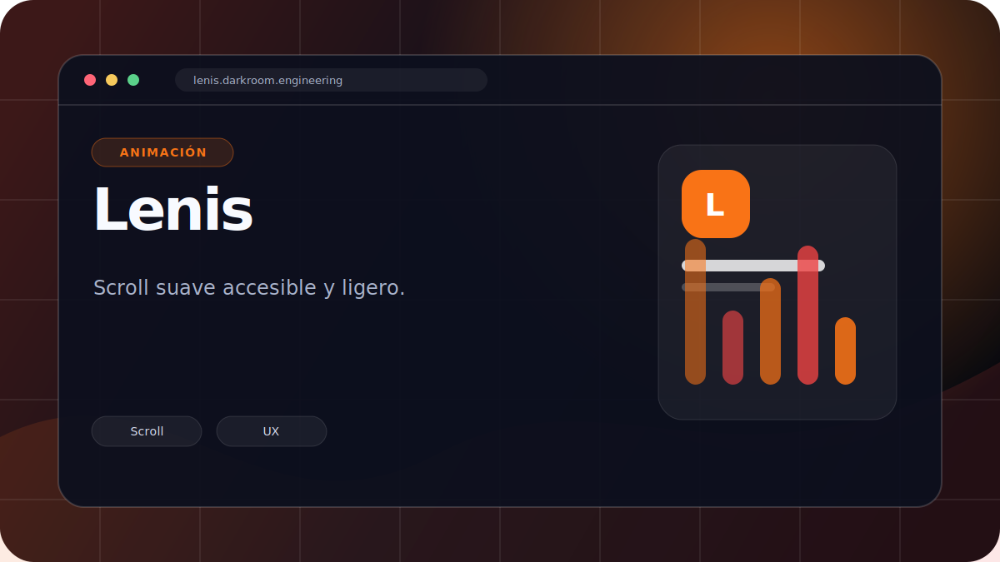</a> | **[Lenis](https://lenis.darkroom.engineering)**<br>Scroll suave accesible y ligero.<br><sub>MIT · gratis</sub> |
| <a href="https://super-wow-ui-design.vercel.app/recursos/rive">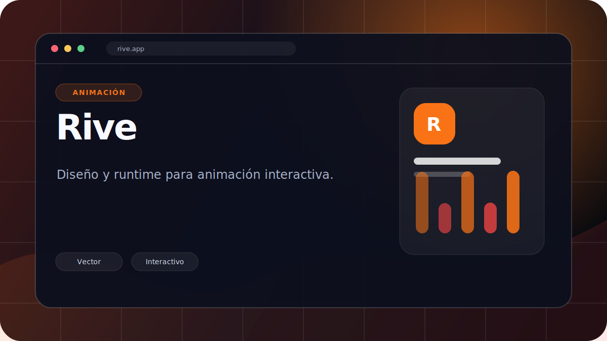</a> | **[Rive](https://rive.app)**<br>Diseño y runtime para animación interactiva.<br><sub>Propietaria · freemium</sub> |
| <a href="https://super-wow-ui-design.vercel.app/recursos/auto-animate">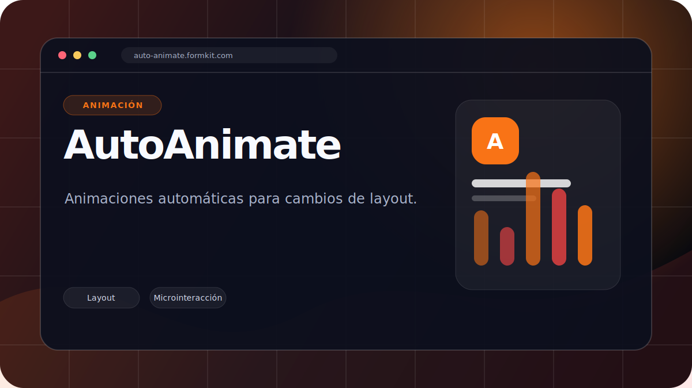</a> | **[AutoAnimate](https://auto-animate.formkit.com)**<br>Animaciones automáticas para cambios de layout.<br><sub>MIT · gratis</sub> |
| <a href="https://super-wow-ui-design.vercel.app/recursos/view-transitions-api">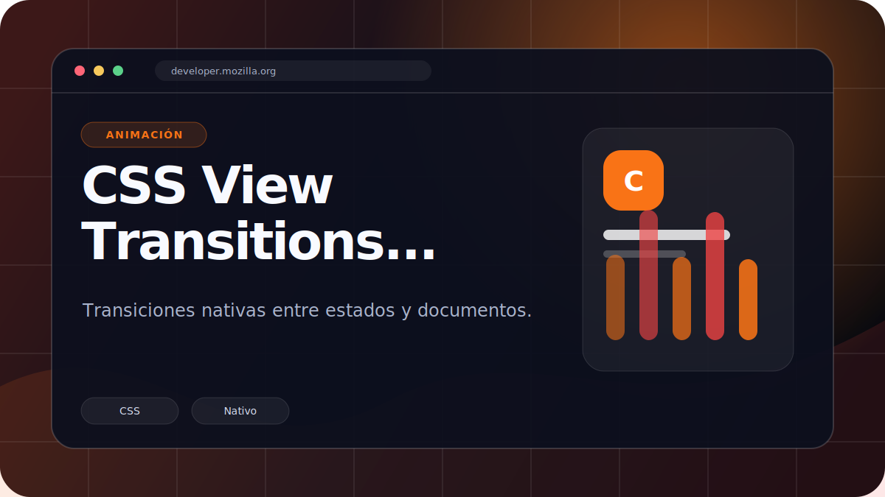</a> | **[CSS View Transitions API](https://developer.mozilla.org/docs/Web/API/View_Transition_API)**<br>Transiciones nativas entre estados y documentos.<br><sub>Estándar web · gratis</sub> |
| <a href="https://super-wow-ui-design.vercel.app/recursos/scroll-driven-animations">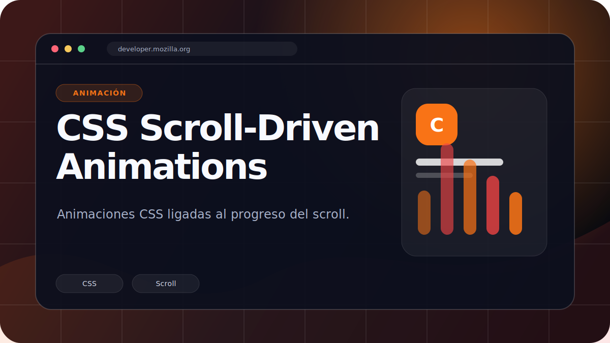</a> | **[CSS Scroll-Driven Animations](https://developer.mozilla.org/docs/Web/CSS/CSS_scroll-driven_animations)**<br>Animaciones CSS ligadas al progreso del scroll.<br><sub>Estándar web · gratis</sub> |

<a id="3d"></a>

## 3D

| Vista | Recurso |
| --- | --- |
| <a href="https://super-wow-ui-design.vercel.app/recursos/threejs"></a> | **[Three.js](https://threejs.org)**<br>Motor 3D de referencia para la web.<br><sub>MIT · gratis</sub> |
| <a href="https://super-wow-ui-design.vercel.app/recursos/react-three-fiber">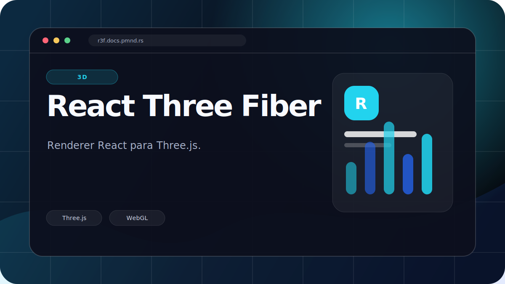</a> | **[React Three Fiber](https://r3f.docs.pmnd.rs)**<br>Renderer React para Three.js.<br><sub>MIT · gratis</sub> |
| <a href="https://super-wow-ui-design.vercel.app/recursos/spline">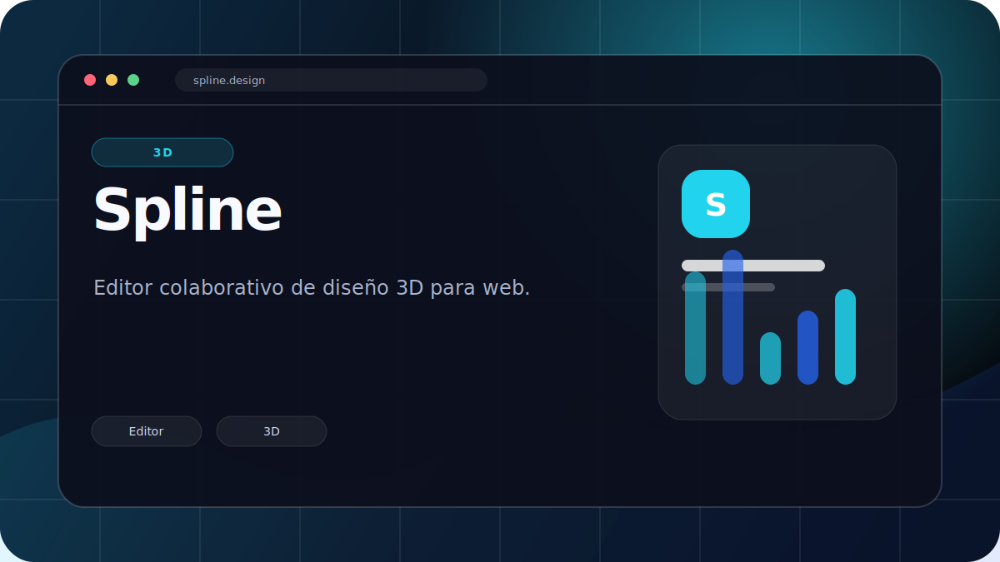</a> | **[Spline](https://spline.design)**<br>Editor colaborativo de diseño 3D para web.<br><sub>Propietaria · freemium</sub> |

<a id="rendimiento"></a>

## Rendimiento

| Vista | Recurso |
| --- | --- |
| <a href="https://super-wow-ui-design.vercel.app/recursos/next-image">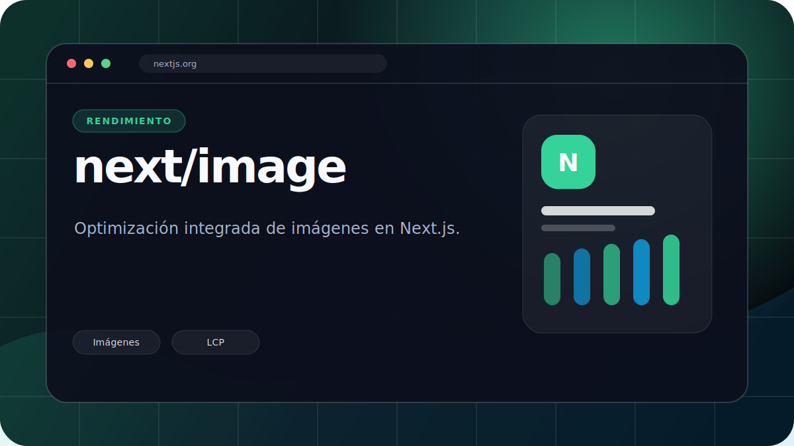</a> | **[next/image](https://nextjs.org/docs/app/api-reference/components/image)**<br>Optimización integrada de imágenes en Next.js.<br><sub>MIT · gratis</sub> |
| <a href="https://super-wow-ui-design.vercel.app/recursos/next-font">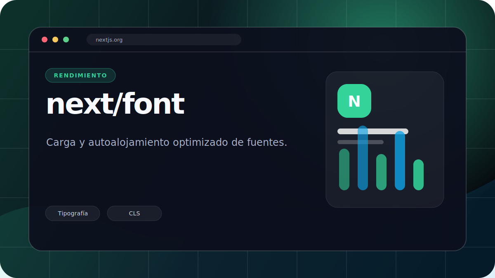</a> | **[next/font](https://nextjs.org/docs/app/getting-started/fonts)**<br>Carga y autoalojamiento optimizado de fuentes.<br><sub>MIT · gratis</sub> |
| <a href="https://super-wow-ui-design.vercel.app/recursos/vercel">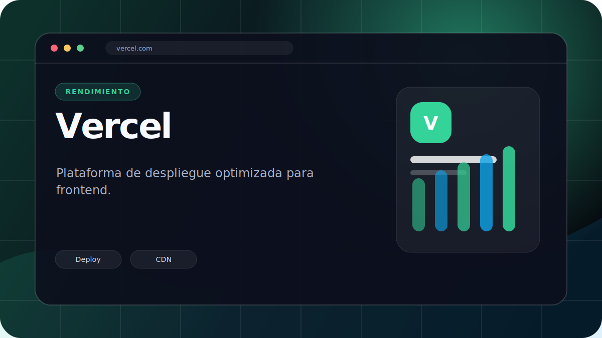</a> | **[Vercel](https://vercel.com)**<br>Plataforma de despliegue optimizada para frontend.<br><sub>Propietaria · freemium</sub> |
| <a href="https://super-wow-ui-design.vercel.app/recursos/core-web-vitals">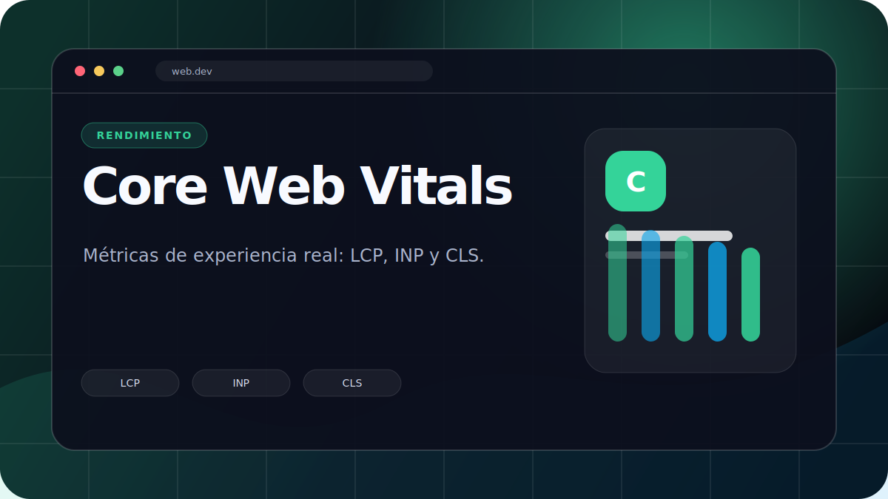</a> | **[Core Web Vitals](https://web.dev/vitals)**<br>Métricas de experiencia real: LCP, INP y CLS.<br><sub>Estándar web · gratis</sub> |
| <a href="https://super-wow-ui-design.vercel.app/recursos/web-quality-skills"></a> | **[Web Quality Skills](https://github.com/addyosmani/web-quality-skills)**<br>Reglas reutilizables para Lighthouse, Core Web Vitals, WCAG 2.2 y SEO.<br><sub>MIT · gratis</sub> |
| <a href="https://super-wow-ui-design.vercel.app/recursos/playwright-mcp">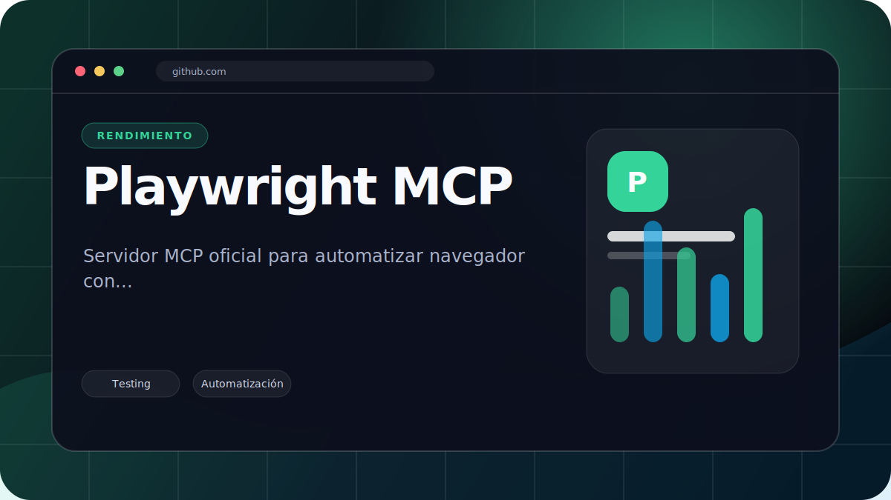</a> | **[Playwright MCP](https://github.com/microsoft/playwright-mcp)**<br>Servidor MCP oficial para automatizar navegador con Playwright.<br><sub>Apache-2.0 · gratis</sub> |

<a id="accesibilidad"></a>

## Accesibilidad

| Vista | Recurso |
| --- | --- |
| <a href="https://super-wow-ui-design.vercel.app/recursos/prefers-reduced-motion">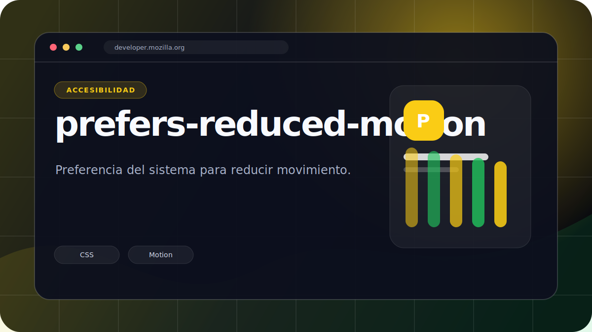</a> | **[prefers-reduced-motion](https://developer.mozilla.org/docs/Web/CSS/@media/prefers-reduced-motion)**<br>Preferencia del sistema para reducir movimiento.<br><sub>Estándar web · gratis</sub> |
| <a href="https://super-wow-ui-design.vercel.app/recursos/lucide">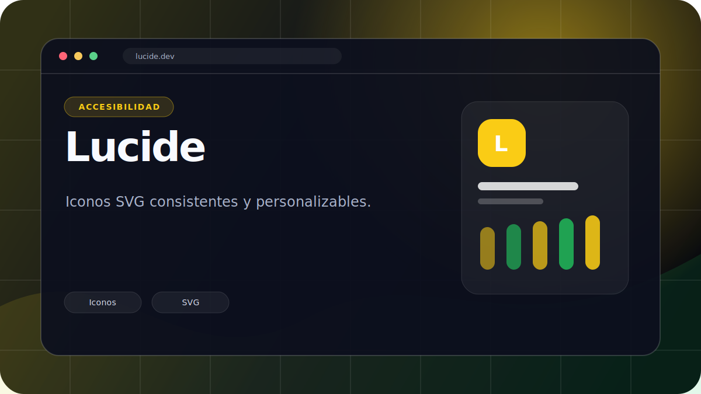</a> | **[Lucide](https://lucide.dev)**<br>Iconos SVG consistentes y personalizables.<br><sub>ISC · gratis</sub> |
| <a href="https://super-wow-ui-design.vercel.app/recursos/fontsource">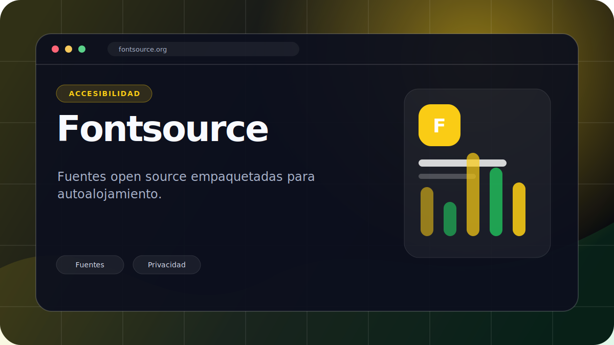</a> | **[Fontsource](https://fontsource.org)**<br>Fuentes open source empaquetadas para autoalojamiento.<br><sub>MIT · gratis</sub> |

<a id="seo-analitica"></a>

## SEO y analítica

| Vista | Recurso |
| --- | --- |
| <a href="https://super-wow-ui-design.vercel.app/recursos/vercel-analytics">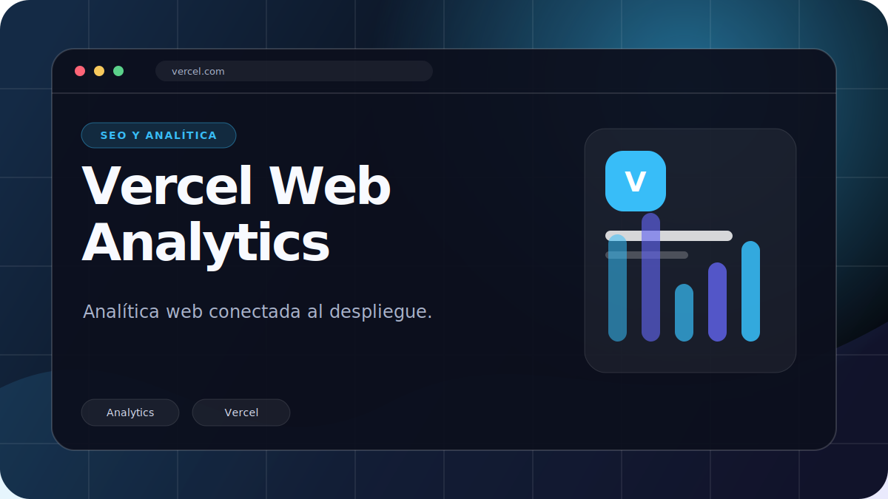</a> | **[Vercel Web Analytics](https://vercel.com/analytics)**<br>Analítica web conectada al despliegue.<br><sub>Propietaria · freemium</sub> |
| <a href="https://super-wow-ui-design.vercel.app/recursos/ga4">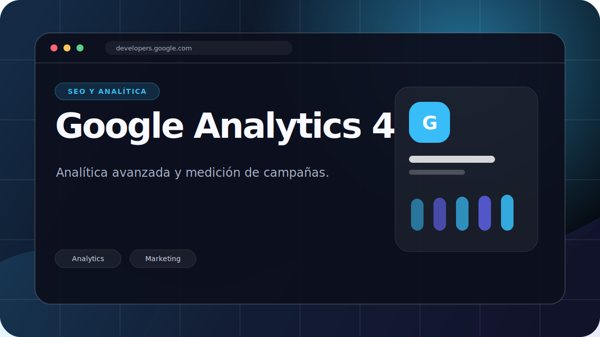</a> | **[Google Analytics 4](https://developers.google.com/analytics/devguides/collection/ga4)**<br>Analítica avanzada y medición de campañas.<br><sub>Propietaria · gratis</sub> |
| <a href="https://super-wow-ui-design.vercel.app/recursos/json-ld">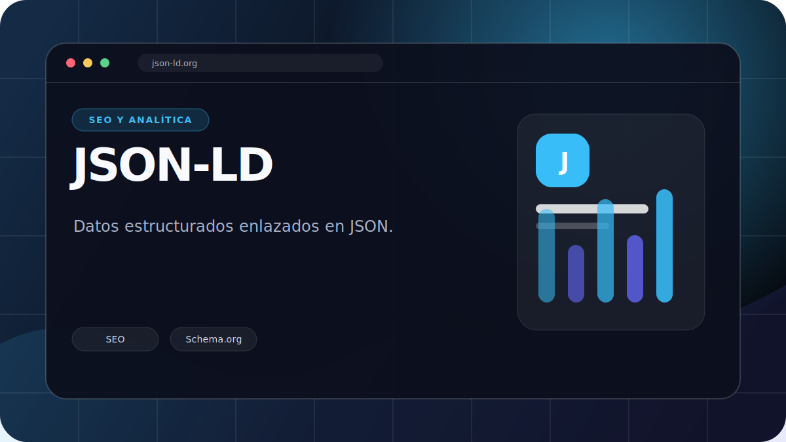</a> | **[JSON-LD](https://json-ld.org)**<br>Datos estructurados enlazados en JSON.<br><sub>Estándar web · gratis</sub> |

<a id="patrones"></a>

## Patrones e inspiración

| Vista | Recurso |
| --- | --- |
| <a href="https://super-wow-ui-design.vercel.app/recursos/backdrop-filter">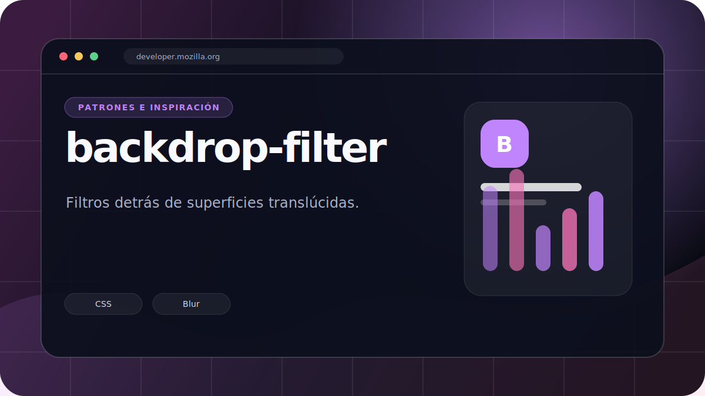</a> | **[backdrop-filter](https://developer.mozilla.org/docs/Web/CSS/backdrop-filter)**<br>Filtros detrás de superficies translúcidas.<br><sub>Estándar web · gratis</sub> |
| <a href="https://super-wow-ui-design.vercel.app/recursos/liquid-glass">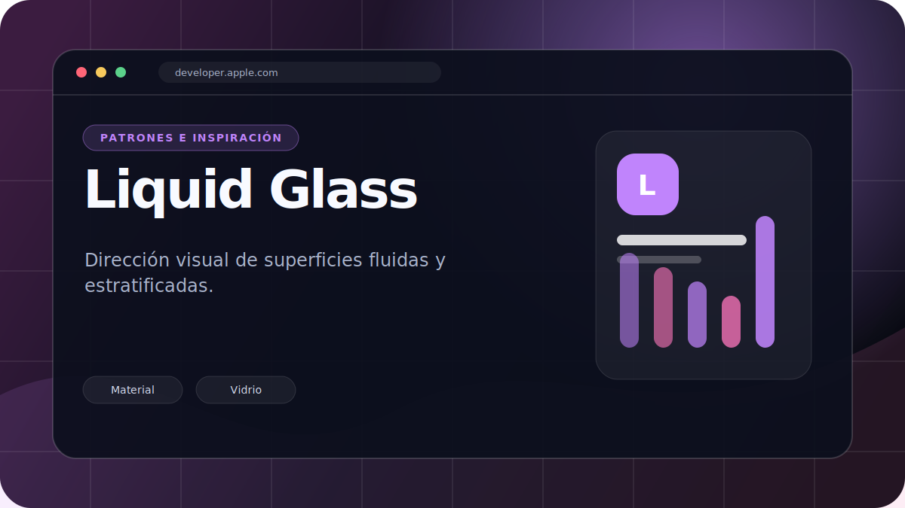</a> | **[Liquid Glass](https://developer.apple.com/design/human-interface-guidelines/materials)**<br>Dirección visual de superficies fluidas y estratificadas.<br><sub>Patrón de diseño · gratis</sub> |
| <a href="https://super-wow-ui-design.vercel.app/recursos/glassmorphism">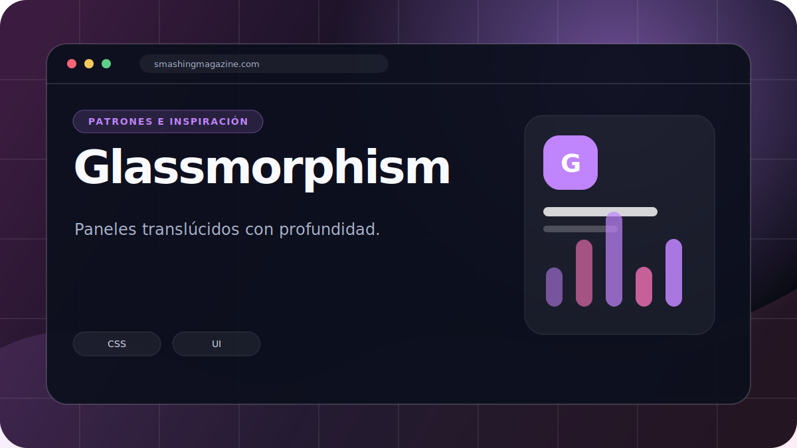</a> | **[Glassmorphism](https://css.glass)**<br>Paneles translúcidos con profundidad.<br><sub>Patrón de diseño · gratis</sub> |
| <a href="https://super-wow-ui-design.vercel.app/recursos/bento-grid">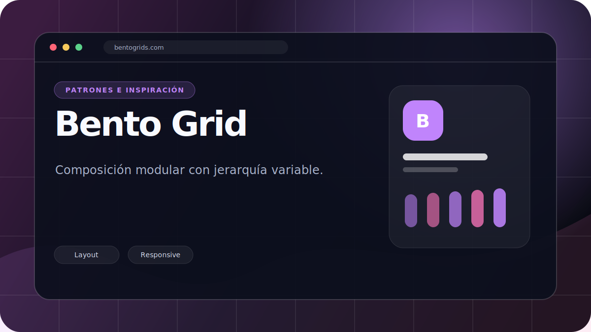</a> | **[Bento Grid](https://bentogrids.com)**<br>Composición modular con jerarquía variable.<br><sub>Patrón de diseño · gratis</sub> |
| <a href="https://super-wow-ui-design.vercel.app/recursos/mobbin">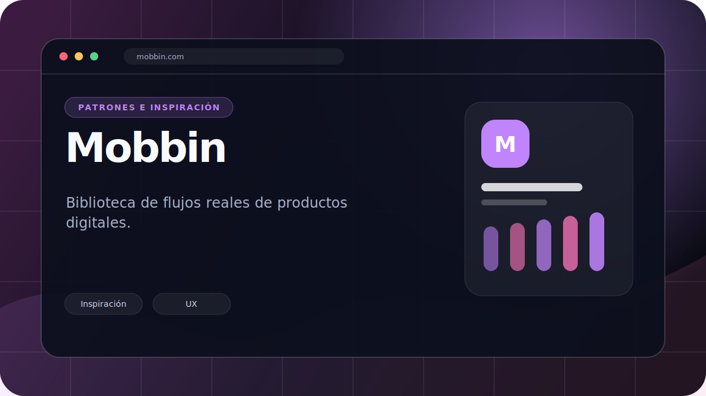</a> | **[Mobbin](https://mobbin.com)**<br>Biblioteca de flujos reales de productos digitales.<br><sub>Propietaria · freemium</sub> |
| <a href="https://super-wow-ui-design.vercel.app/recursos/godly">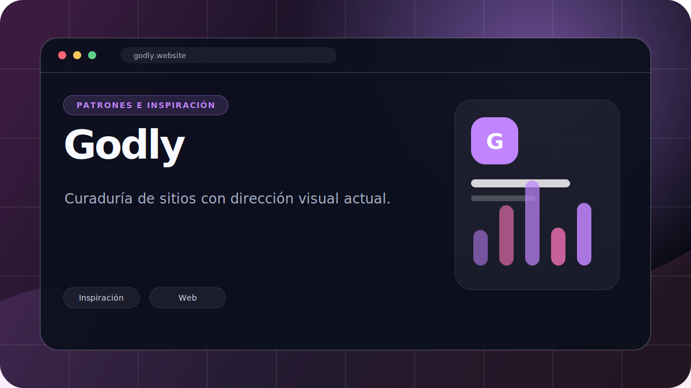</a> | **[Godly](https://godly.website)**<br>Curaduría de sitios con dirección visual actual.<br><sub>Propietaria · gratis</sub> |
| <a href="https://super-wow-ui-design.vercel.app/recursos/typeui">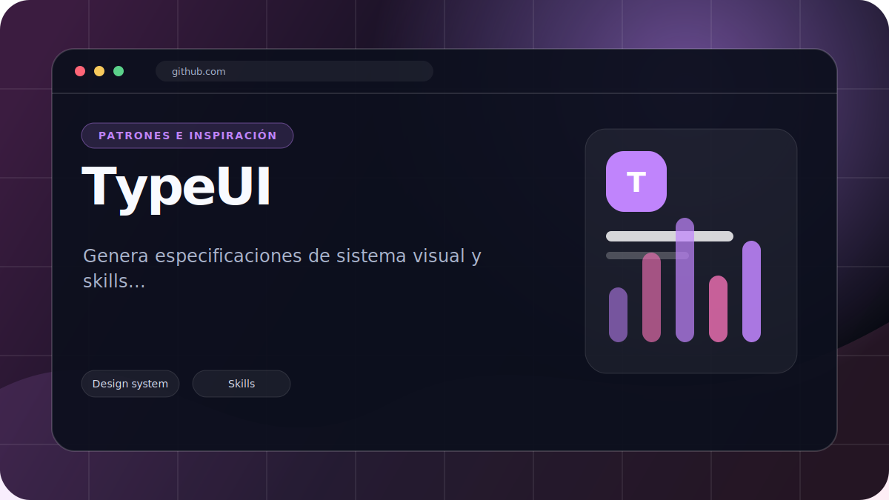</a> | **[TypeUI](https://github.com/bergside/typeui)**<br>Genera especificaciones de sistema visual y skills para asistentes de código.<br><sub>MIT · gratis</sub> |
| <a href="https://super-wow-ui-design.vercel.app/recursos/design-md-chrome">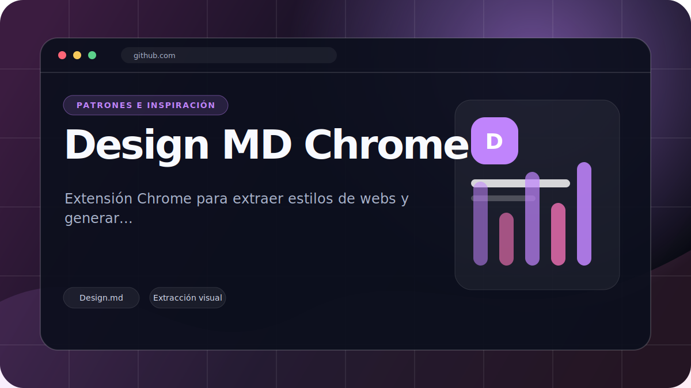</a> | **[Design MD Chrome](https://github.com/bergside/design-md-chrome)**<br>Extensión Chrome para extraer estilos de webs y generar DESIGN.md.<br><sub>MIT · gratis</sub> |

## Diseños y componentes

La web incluye ejemplos completos para ver cómo se combinan estas herramientas:

- [Landing cinematográfica](https://super-wow-ui-design.vercel.app/plantillas/landing)
- [Dashboard moderno](https://super-wow-ui-design.vercel.app/plantillas/dashboard)
- [Portfolio editorial](https://super-wow-ui-design.vercel.app/plantillas/portfolio)
- [Experiencia inmersiva](https://super-wow-ui-design.vercel.app/plantillas/cinematic)
- [Bloques de interfaz](https://super-wow-ui-design.vercel.app/componentes)

## Instalar bloques liquid UI

El registry público está en [`https://super-wow-ui-design.vercel.app/registry.json`](https://super-wow-ui-design.vercel.app/registry.json).

| Bloque | Uso | Instalar |
| --- | --- | --- |
| `liquid-hero` | Hero cinematic con liquid glass, profundidad y preview. | `pnpm dlx shadcn@latest add https://super-wow-ui-design.vercel.app/r/liquid-hero.json` |
| `liquid-bento` | Grid bento con tarjetas liquid y jerarquía editorial. | `pnpm dlx shadcn@latest add https://super-wow-ui-design.vercel.app/r/liquid-bento.json` |
| `liquid-dashboard-shell` | Shell de dashboard con métricas y actividad. | `pnpm dlx shadcn@latest add https://super-wow-ui-design.vercel.app/r/liquid-dashboard-shell.json` |
| `cinematic-section` | Sección narrativa para landing, SaaS o portfolio. | `pnpm dlx shadcn@latest add https://super-wow-ui-design.vercel.app/r/cinematic-section.json` |
| `liquid-resource-card` | Tarjeta de recurso con glass, CTA y hover. | `pnpm dlx shadcn@latest add https://super-wow-ui-design.vercel.app/r/liquid-resource-card.json` |

Ejemplo:

```bash
pnpm dlx shadcn@latest add https://super-wow-ui-design.vercel.app/r/liquid-hero.json
```

## Estructura

```txt
apps/web                 Next.js app, galería y documentación
apps/web/lib/catalog.ts  Fuente tipada del catálogo
apps/web/public          Portadas SVG y assets públicos
packages/ui              Componentes compartidos y bloques liquid UI
packages/effects         Utilidades de animación y motion safety
apps/web/public/r        Bloques compatibles con shadcn registry
```

## Ejecutar la web

```bash
corepack enable
corepack pnpm install
corepack pnpm dev
```

Después abre `http://localhost:3000`.

## Actualizar el catálogo

```bash
corepack pnpm resources:images
corepack pnpm readme:generate
corepack pnpm links:check
corepack pnpm check
```

El catálogo, las portadas y este README se generan desde
`apps/web/lib/catalog.ts`.

## Contribuir

Abre un issue o pull request en [https://github.com/jesusoldekamp-hue/super-wow-ui-design](https://github.com/jesusoldekamp-hue/super-wow-ui-design). Para que un recurso entre debe incluir:

- enlace oficial;
- licencia y precio;
- motivo concreto para recomendarlo;
- evidencia de mantenimiento activo;
- categoría adecuada y alternativas que reemplazaría.

No se aceptan recursos abandonados, duplicados o premium sin valor claro para construir mejores interfaces.

## Licencia

Código propio bajo [MIT](./LICENSE). Los recursos enlazados conservan las
licencias, marcas y derechos de sus respectivos autores.
